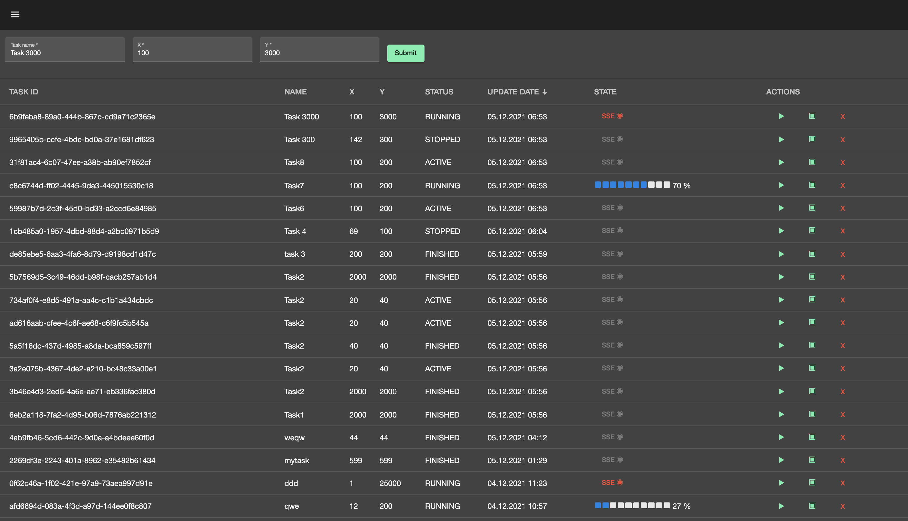
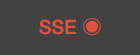
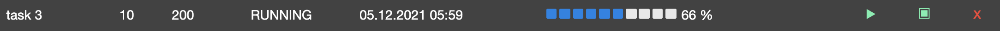

# Ctm-client - Front end challenge application.

### Client application & design.

Ctm-client application follows SPA design patterns and has tasks table as its core design element. It is integrated into side menu navigation that allows switching between different applications. As of now only **Counter task** application is implement. **Project generation** application page has only development comments. 
For the sake of time saving I have stepped away from some design requirements like Stepper for task creation. I have also enhanced Counter tasks table with task execution progress async controls, to demonstrate Angular's, multy tasking capabilities.  
And of course, there is a long TODO list to improve the client, however I believe that the core features are implemented and could be reused in future development tasks.  
All in all I'm very satisfied with the results that were achieved in very dense timelines.

## Client Features

**Counter Tasks Main Page:**


**Counter Task Controls:**  
Run, Stop and Delete:  


**Subscribe to Execution State (SSE):**  
If task is in RUNNING status you can subscribe to its execution progress.  


**Execution State progress bar:**  
You can now track the execution! 


**Custom page not found interceptor:**  
Just try it!  


### Front End anatomy:
* TypeScript/JavaScript - core programming language.
* NPM - Package manager. Build automation.
* Angular13 - front-end framework.
* RxJS - Reactive/Asynchronous integration with backend. Observables, Subscriptions, Operators.
* AngularMaterial - UI Components.
* HTML5 - Animations, effects, validations.

### Build/Run steps

You will need NODE, NPM, Angular CLI.

You can import it into your IDE as gradle project so you can review source code build/test it using IDE.

Or build/run it manually:

In client folder run:
```sh
npm install
ng build --prod=true
ng serve --proxy-config proxy.conf.json
```
this will start client on http://localhost:4200/

Make sure **cln-task-manager** application is running and inlined with **[Proxy file](./proxy.conf.json)** to receive calls from Front-End client.
  
Georgy Saukov,  
Munich, December 2021.
